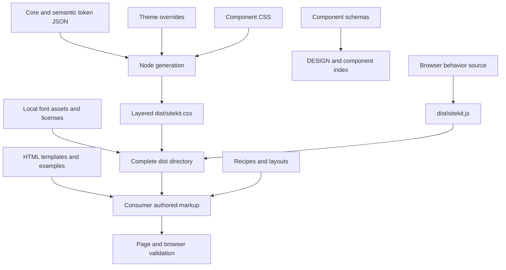

# Architecture and public API

VERIFIED against `package.json`, `scripts/sitekit.js`, `scripts/sitekit-behavior.js`, component source, tokens and tests.

## Package boundaries and export map

One package: `@kujolang/sitekit` 1.0.0, `private: true`, `type: commonjs`, Node >=20 for generation. No runtime dependencies; Playwright and axe are development dependencies. No root `.` export, `main`, component barrel, TypeScript declarations, framework adapter or hook package. No explicit deprecated export declarations found.

| Surface | Path / API | Meaning |
| --- | --- | --- |
| Supported CSS subpath | `./sitekit.css` → `./dist/sitekit.css` | Entire stylesheet, no component tree shaking |
| Supported script subpath | `./sitekit.js` → `./dist/sitekit.js` | Browser IIFE; not a Node module import |
| Fonts | `./fonts/*` → `./dist/fonts/*` | WOFF2, WOFF and license |
| Package metadata | `./package.json` | Build/release metadata |
| Source contracts | `components/<slug>/<slug>.schema.json` | Declarative props, slots, requirements; not runtime validation |
| Source templates | `components/<slug>/<slug>.html` | Semantic HTML; placeholders or hardcoded examples |
| Style selectors | `.sk-*`, data attributes, native/ARIA selectors | Actual reusable visual API |
| Runtime global | `window.SiteKit.enhance()` | Document-wide enhancement; returns undefined |
| Utility API | `.sk-container`, `.sk-stack`, `.sk-cluster`, `.sk-grid`, `.sk-muted`, `.sk-sr-only` | Six shared CSS helpers |
| Composition contracts | `recipes/*.json`, `layouts/*.html` | Eight recipes and six starter pages |
| Distribution integrity | `dist/sitekit-manifest.json` | Hashes and entrypoints, not a component manifest |

The source-vendored directory is the v1 consumer contract; npm publication is explicitly excluded. A file-copy consumer uses a link and optional deferred script, not `import { Button } from '@kujolang/sitekit'`. Templates/schemas/recipes remain in the source checkout; they are not present in the small dist archive.

## Generation

`scripts/build` calls generateCss, generateDesign and generateDistribution. `scripts/generate-css` also creates dist. `scripts/lint` regenerates CSS/design before validation; it is not ESLint or a full CSS linter. `scripts/generate-design-md` also updates the component index. `scripts/snapshot-components` serializes schema names, variants and example counts, with a fixed generatedAt value of 2026-08-08.

Token flattening skips `$schema`, `name`, `description`; leaf `{ value }` objects become `--sk-*` declarations. Dotted/camelCase paths are normalized to kebab-case. Semantic and theme references such as `{color.black}` become `var(--sk-color-black)`. Component CSS files are sorted alphabetically and concatenated. The distribution bundles reset, tokens, themes, base, components, utilities; named cascade layers are first established in that order. Consumer overrides should live in a later named layer and be limited to composition.

Distribution generation removes and recreates dist, rewrites font URLs from `../fonts/` to `./fonts/`, copies browser behavior, copies fonts/licenses and hashes seven payload files. Do not modify generated files manually. Release archive tooling is inert packaging; it does not deploy a website. Release workflows upload artifacts; hosted availability is a separate operation.

## Runtime lifecycle and helper inventory

The IIFE auto-runs after DOMContentLoaded, or immediately if the document is ready. `enhance()` scans the whole document for supported patterns. WeakSets prevent duplicate listeners on already enhanced containers. It can discover newly inserted containers when explicitly called again, but has no MutationObserver, root argument, cleanup function, destroy API or configurable behavior options.

Internal helpers are not exports: `nextId` avoids document ID collisions; `focusable` filters disabled/hidden/inert/aria-hidden ancestors and display/visibility; `controlsTargeting` finds attribute-to-ID matches; `setExpanded` updates trigger and panel state; `closeOnOutside` tests containment; `trapFocus` cycles first/last focusable elements. Enhancement families are dropdowns, popovers, tooltips, modal, drawers and themes. There are no React-style hooks or callback props.

A newly added opener for an already enhanced dialog/drawer will not be rebound, because openers were collected on first enhancement. Detached containers can retain document-level listeners. For preview rerendering, replace an entire iframe document or use stable containers; do not repeatedly replace children and assume enhance repairs all relationships. Focus selection does not understand every hidden layout case or custom widget focus model.

The complete hook list and behavior boundaries are in `component-manifest.json.runtime` and 06. CSS selectors can support states without implementing state transitions. Native browser behavior is a third, separate provider.

## Consumption and duplicate abstractions

`examples/consumer-dashboard/index.html` loads dist directly and layers dashboard-specific CSS. Most other examples/layouts load individual source CSS files. The component lab embeds a manually authored catalog and custom sample rendering; it does not import a runtime component registry or execute schemas.

`sk-stack` is a utility; `sk-stack-component` is the schema-backed Stack with styled panels. `sk-sr-only` and `sk-visually-hidden` are separate clipping implementations. File is a file row; File Upload is a native input frame. Date Input is native; Date Picker is a calendar mockup. Progress Bar, Progress Indicator, Spinner and Skeleton are distinct visual/semantic concepts. Command Strip is metadata, not a command menu. Table and Pricing Table have different overflow strategies. These distinctions should become search aliases and comparison links, not merged exports.

Potentially reusable internals include safe unique-ID generation, bounded enhancement lifecycle, clipboard feedback from the lab and native value adapters. Promote only after hardening and tests; none is currently a public standalone helper.
