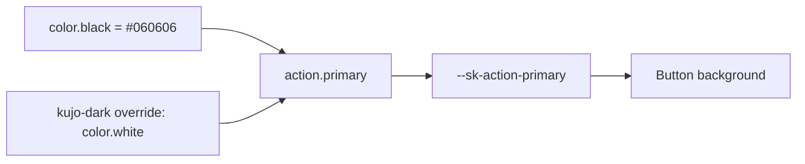

# Foundations: complete token and styling reference

VERIFIED from tokens/core.json, tokens/semantic.json, four tokens/themes files, css/base.css, css/reset.css, css/utilities.css and component CSS. token-manifest.json contains all raw values, reference edges, resolved theme values and direct component references.

## Token relationship model

Flattening converts camelCase and dotted paths to kebab CSS names (action.primaryText → --sk-action-primary-text). Core values are literal; semantic aliases become var() references; theme selectors override only listed values. Themes do not replace the whole token object. No runtime theme compiler or arbitrary theme editor exists.

## Themes and cascade

kujo-light is the default design identity; kujo-dark reverses key surfaces/actions and adds bright state colors. personal-dark uses warmer off-white text and dark blue-gray surfaces. bzby uses warm paper with teal link/focus. Dark themes set color-scheme:dark in base CSS; the other themes remain light. Theme control storage uses sk-theme and supports exactly those four names. There is no prefers-color-scheme auto-selection or cross-tab storage listener.

Theme application should be at html. Semantic var aliases inherited from root can resolve differently from an assumed nested-theme model, so use separate preview documents for reliable four-theme comparison. The code surface/text/border semantic family is not overridden in the theme files: a light code panel in a dark theme can be intentional source output. border.strong and some status/text tokens also inherit defaults unless explicitly overridden; verify actual pairs.

## Typography

font.sans is a system monospace stack, not a sans-serif. font.mono adds Departure Mono. The font-face ships only regular weight 400, local WOFF2/WOFF, font-display:swap. Medium 520 and bold 700 may be synthesized or rendered by fallback fonts; no separate bold/italic asset exists. Base body uses 1.5 line height; h1/h2 use Departure Mono at regular weight, h1–h4 use tight line height, h5/h6 have no equivalent explicit base rule. Code/kbd/samp use mono. Many labels are uppercase xs; no caption/prose token family or Markdown renderer exists.

Base letter spacing is zero; hero line-height .9 bypasses the line tokens. Hero h1/h2 scale at 56rem container size from 3rem to 5.375rem. There is no general responsive type API. Component record CSS identifies local variations.

## Complete core token values

| Token | CSS variable | Raw value |
| --- | --- | --- |
| color.black | `--sk-color-black` | `#060606` |
| color.white | `--sk-color-white` | `#ffffff` |
| color.paper | `--sk-color-paper` | `#f9f9f9` |
| color.ink | `--sk-color-ink` | `#060606` |
| color.gray.50 | `--sk-color-gray-50` | `#f9f9f9` |
| color.gray.100 | `--sk-color-gray-100` | `#eeeeee` |
| color.gray.300 | `--sk-color-gray-300` | `#b8b8b8` |
| color.gray.500 | `--sk-color-gray-500` | `#5d5d5d` |
| color.gray.700 | `--sk-color-gray-700` | `#2b2b2b` |
| color.gray.900 | `--sk-color-gray-900` | `#111111` |
| color.blue.600 | `--sk-color-blue-600` | `#1646d2` |
| color.green.600 | `--sk-color-green-600` | `#0f6b35` |
| color.yellow.500 | `--sk-color-yellow-500` | `#765000` |
| color.red.600 | `--sk-color-red-600` | `#a31515` |
| color.cyan.600 | `--sk-color-cyan-600` | `#075d6c` |
| font.sans | `--sk-font-sans` | `"SFMono-Regular", "Cascadia Code", "Roboto Mono", "Liberation Mono", Menlo, Consolas, monospace` |
| font.mono | `--sk-font-mono` | `"Departure Mono", "SFMono-Regular", "Cascadia Code", "Roboto Mono", "Liberation Mono", Menlo, Consolas, monospace` |
| type.size.xs | `--sk-type-size-xs` | `0.75rem` |
| type.size.sm | `--sk-type-size-sm` | `0.875rem` |
| type.size.md | `--sk-type-size-md` | `1rem` |
| type.size.lg | `--sk-type-size-lg` | `1.125rem` |
| type.size.xl | `--sk-type-size-xl` | `1.375rem` |
| type.size.2xl | `--sk-type-size-2xl` | `1.75rem` |
| type.size.3xl | `--sk-type-size-3xl` | `2.25rem` |
| type.size.4xl | `--sk-type-size-4xl` | `3rem` |
| type.size.5xl | `--sk-type-size-5xl` | `5.375rem` |
| type.line.tight | `--sk-type-line-tight` | `1.1` |
| type.line.normal | `--sk-type-line-normal` | `1.5` |
| type.line.loose | `--sk-type-line-loose` | `1.7` |
| type.weight.regular | `--sk-type-weight-regular` | `400` |
| type.weight.medium | `--sk-type-weight-medium` | `520` |
| type.weight.bold | `--sk-type-weight-bold` | `700` |
| space.0 | `--sk-space-0` | `0` |
| space.1 | `--sk-space-1` | `0.25rem` |
| space.2 | `--sk-space-2` | `0.5rem` |
| space.3 | `--sk-space-3` | `0.75rem` |
| space.4 | `--sk-space-4` | `1rem` |
| space.5 | `--sk-space-5` | `1.25rem` |
| space.6 | `--sk-space-6` | `1.5rem` |
| space.8 | `--sk-space-8` | `2rem` |
| space.10 | `--sk-space-10` | `2.5rem` |
| space.12 | `--sk-space-12` | `3rem` |
| space.16 | `--sk-space-16` | `4rem` |
| space.20 | `--sk-space-20` | `5rem` |
| space.24 | `--sk-space-24` | `6rem` |
| size.content.sm | `--sk-size-content-sm` | `42rem` |
| size.content.md | `--sk-size-content-md` | `64rem` |
| size.content.lg | `--sk-size-content-lg` | `78rem` |
| size.content.xl | `--sk-size-content-xl` | `92rem` |
| size.control.sm | `--sk-size-control-sm` | `2rem` |
| size.control.md | `--sk-size-control-md` | `2.5rem` |
| size.control.lg | `--sk-size-control-lg` | `3rem` |
| border.0 | `--sk-border-0` | `0` |
| border.1 | `--sk-border-1` | `1px` |
| border.2 | `--sk-border-2` | `2px` |
| border.heavy | `--sk-border-heavy` | `3px` |
| radius.0 | `--sk-radius-0` | `0` |
| radius.1 | `--sk-radius-1` | `2px` |
| radius.2 | `--sk-radius-2` | `4px` |
| radius.3 | `--sk-radius-3` | `6px` |
| shadow.none | `--sk-shadow-none` | `none` |
| shadow.hard | `--sk-shadow-hard` | `none` |
| shadow.hardSm | `--sk-shadow-hard-sm` | `none` |
| motion.fast | `--sk-motion-fast` | `120ms` |
| motion.base | `--sk-motion-base` | `180ms` |
| motion.slow | `--sk-motion-slow` | `260ms` |
| motion.ease | `--sk-motion-ease` | `cubic-bezier(.2,0,0,1)` |
| z.base | `--sk-z-base` | `0` |
| z.dropdown | `--sk-z-dropdown` | `20` |
| z.sticky | `--sk-z-sticky` | `30` |
| z.modal | `--sk-z-modal` | `80` |
| z.toast | `--sk-z-toast` | `90` |
| focus.width | `--sk-focus-width` | `2px` |
| focus.offset | `--sk-focus-offset` | `3px` |
| breakpoint.sm | `--sk-breakpoint-sm` | `36rem` |
| breakpoint.md | `--sk-breakpoint-md` | `48rem` |
| breakpoint.lg | `--sk-breakpoint-lg` | `64rem` |
| breakpoint.xl | `--sk-breakpoint-xl` | `80rem` |

## Complete semantic values and themes

Values below are statically resolved. They are not measured contrast or computed cascade assertions.

| Token | Reference/default | kujo-light | kujo-dark | personal-dark | bzby |
| --- | --- | --- | --- | --- | --- |
| surface.page | `{color.paper}` | #f9f9f9 | #060606 | #0f1115 | #fffaf0 |
| surface.raised | `{color.white}` | #ffffff | #111111 | #171a20 | #ffffff |
| surface.card | `{color.white}` | #ffffff | #111111 | #171a20 | #ffffff |
| surface.inverse | `{color.black}` | #060606 | #ffffff | #f7f4ed | #111111 |
| surface.subtle | `{color.white}` | #ffffff | #111111 | #171a20 | #ffffff |
| surface.accent | `{color.ink}` | #060606 | #ffffff | #f7f4ed | #111111 |
| text.primary | `{color.black}` | #060606 | #ffffff | #f7f4ed | #111111 |
| text.secondary | `{color.gray.700}` | #2b2b2b | #eeeeee | #d7d2c8 | #403b33 |
| text.muted | `{color.gray.500}` | #5d5d5d | #b8b8b8 | #a69f94 | #766b5f |
| text.inverse | `{color.white}` | #f9f9f9 | #060606 | #0f1115 | #fffaf0 |
| text.link | `{color.black}` | #060606 | #7dd3fc | #8cc9ff | #085f63 |
| text.danger | `{color.red.600}` | #a31515 | #ff8c8c | #a31515 | #a31515 |
| text.success | `{color.green.600}` | #0f6b35 | #6fdc8c | #0f6b35 | #0f6b35 |
| text.warning | `{color.yellow.500}` | #765000 | #ffd166 | #765000 | #765000 |
| action.primary | `{color.black}` | #060606 | #ffffff | #f7f4ed | #111111 |
| action.primaryText | `{color.white}` | #ffffff | #060606 | #0f1115 | #fffaf0 |
| action.secondary | `{color.white}` | #ffffff | #111111 | #171a20 | #ffffff |
| action.secondaryText | `{color.black}` | #060606 | #ffffff | #f7f4ed | #111111 |
| action.danger | `{color.red.600}` | #a31515 | #ff8c8c | #a31515 | #a31515 |
| action.dangerText | `{color.white}` | #ffffff | #060606 | #ffffff | #ffffff |
| action.ghost | `transparent` | transparent | transparent | transparent | transparent |
| border.default | `{color.black}` | #060606 | #ffffff | #f7f4ed | #111111 |
| border.subtle | `{color.gray.300}` | #5d5d5d | #b8b8b8 | #a69f94 | #766b5f |
| border.strong | `{color.black}` | #060606 | #060606 | #060606 | #060606 |
| border.inverse | `{color.white}` | #ffffff | #ffffff | #ffffff | #ffffff |
| focus.ring | `{color.black}` | #060606 | #7dd3fc | #8cc9ff | #085f63 |
| focus.ringOffset | `{color.paper}` | #f9f9f9 | #060606 | #0f1115 | #fffaf0 |
| shadow.color | `{color.black}` | #060606 | #ffffff | #f7f4ed | #111111 |
| code.surface | `{color.white}` | #ffffff | #ffffff | #ffffff | #ffffff |
| code.text | `{color.black}` | #060606 | #060606 | #060606 | #060606 |
| code.border | `{color.black}` | #060606 | #060606 | #060606 | #060606 |
| state.success | `{color.green.600}` | #0f6b35 | #6fdc8c | #6fdc8c | #0f6b35 |
| state.warning | `{color.yellow.500}` | #765000 | #ffd166 | #ffd166 | #765000 |
| state.danger | `{color.red.600}` | #a31515 | #ff8c8c | #ff8c8c | #a31515 |
| state.info | `{color.cyan.600}` | #075d6c | #7dd3fc | #8cc9ff | #075d6c |
| component.button.height | `{size.control.md}` | 2.5rem | 2.5rem | 2.5rem | 2.5rem |
| component.button.gap | `{space.2}` | 0.5rem | 0.5rem | 0.5rem | 0.5rem |
| component.card.padding | `{space.5}` | 1.25rem | 1.25rem | 1.25rem | 1.25rem |
| component.card.gap | `{space.5}` | 1.25rem | 1.25rem | 1.25rem | 1.25rem |
| component.hero.paddingBlock | `{space.6}` | 1.5rem | 1.5rem | 1.5rem | 1.5rem |
| component.hero.maxWidth | `{size.content.lg}` | 78rem | 78rem | 78rem | 78rem |
| component.grid.gap | `{space.5}` | 1.25rem | 1.25rem | 1.25rem | 1.25rem |

## Layout, surfaces and utilities

The standard maximum container uses 92rem and space.4 gutters; Header/Footer use 78rem and space.5 gutters. Grid is auto-fit min(100%,18rem); Cluster wraps. Component-specific grids use their own min tracks and container queries. Schema breakpoints are descriptive; queries do not interpolate the breakpoint variables.

| Utility | Actual responsibility |
| --- | --- |
| `.sk-container` | Centered 92rem maximum with 1rem gutters |
| `.sk-stack` | Grid stack with space.4 gap; no panel styling |
| `.sk-cluster` | Wrapping centered flex row with space.3 gap |
| `.sk-grid` | Auto-fit grid with min(100%,18rem) tracks |
| `.sk-muted` | Semantic muted text |
| `.sk-sr-only` | Clipped assistive text; no focus reveal |

Most component corners use radius.0 even though 2px/4px/6px tokens exist. Border 1px dominates, with 2px/3px for stronger structure. shadow.none, shadow.hard and shadow.hardSm are all none; there is no real elevation ladder. No shared opacity-token family exists. z-index tokens range from 0 to 90, but native modal top-layer stacking is browser-owned. Icon wrapper sizes reuse control tokens 2rem/2.5rem/3rem; SVG itself is 70 percent of wrapper with currentColor stroke.

## Hardcoded visual values outside tokens

The complete source is hashed in evidence/source-index.json. Significant examples below are not exhaustive numerical trivia; all component CSS rules remain machine-readable in component-manifest.json.

| Source | Bypass / implication |
| --- | --- |
| button.css | opacity .55 for disabled; no opacity token |
| badge.css | 1.5rem minimum height |
| hero.css | .9 line-height; 15ch/67ch text measures; literal 56rem threshold |
| bento-grid.css | 10rem/11rem row minimums, 56rem/34rem thresholds and explicit spans |
| modal.css | 42rem max width, 72 percent backdrop mix |
| popover.css / tooltip.css | 22rem/18rem limits, 80vw popover bound, 50 percent transform placement |
| skeleton.css / spinner.css | 1400ms/1800ms cycles, literal stagger/opacity values |
| grid families | minimum track sizes and aspect ratios |
| textarea.css / rich-text-editor.css | 9rem/10rem minimum heights |
| layouts / examples | project composition widths, offsets and thresholds beyond base tokens |

Hardcoded CSS numbers are not automatically defects: aspect ratios, percentages and semantic layout constants may be legitimate. They must not be represented as tokens unless actually defined. Theme files themselves contain literal colors as an intentional override mechanism; component CSS has no raw hex colors under the static validation rule.

## Iconography and assets

No bundled third-party icon library, runtime registry, icon importer or custom Kujo icon family exists. examples/icons.svg defines github and external-link symbols. Icon template includes a check path; examples/dashboard include other small inline paths. data-icon-name is descriptive only. Keep consumer sprite IDs stable, preserve upstream licensing and use actual SVG markup. An SVG use reference may behave differently under file://; inline SVG is the simplest portable sample. The site should demonstrate this small contract rather than claim a catalog of hundreds of icons.

## Styling systems absent

No Tailwind, Sass, CSS-in-JS, CSS Modules, theme provider, token-aware layout runtime or framework hook layer appears in the package. Class selectors and named CSS layers are the public style system. Source/component styles plus later site composition overrides are sufficient.
